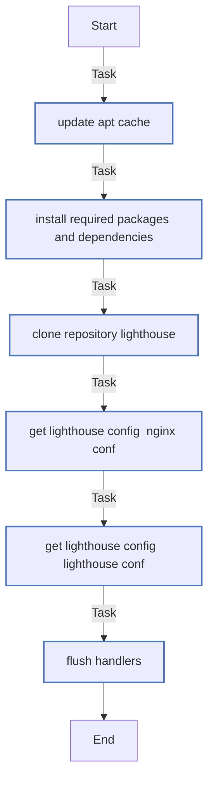

# Роль Lighthouse (08-ansible-04-role-lighthouse)

Описание: Роль устанавливает Lighthouse

| Field                | Value           |
|--------------------- |-----------------|
| Readme update        | 09/02/2025 |

### Defaults: Статические переменные с низким приоритетом

#### Файл: defaults/main.yml

| Var          | Type         | Value       |Required    | Title       |
|--------------|--------------|-------------|-------------|-------------|
| [lighthouse_web_user](defaults/main.yml#L2)   | str   | `www-data` |    n/a  |  n/a |
| [lighthouse_web_port](defaults/main.yml#L3)   | str   | `8888` |    n/a  |  n/a |

### Vars: Статические переменные с высоким приоритетом

#### Файл: vars/main.yml

| Var          | Type         | Value       |Required    | Title       |
|--------------|--------------|-------------|-------------|-------------|
| [lighthouse_repository](vars/main.yml#L2)   | str   | `https://github.com/VKCOM/lighthouse.git` |    n/a  |  n/a |

### Tasks: Задания

#### File: tasks/main.yml

| Name | Module | Has Conditions |
| ---- | ------ | --------- |
| Update apt cache | apt | False |
| Install required packages and dependencies | apt | False |
| Clone repository lighthouse | git | False |
| Get lighthouse config (nginx.conf) | template | False |
| Get lighthouse config (lighthouse.conf) | template | False |
| Flush handlers |  | False |


## Сценарий

```yml
---
- hosts: localhost
  remote_user: root
  roles:
    - lighthouse-role

```

## Автор

tvm2360

#### Лицензия

MIT

#### Минимальная верия ansible

2.10

#### Платформы

- **Ubuntu**: [20.04]
